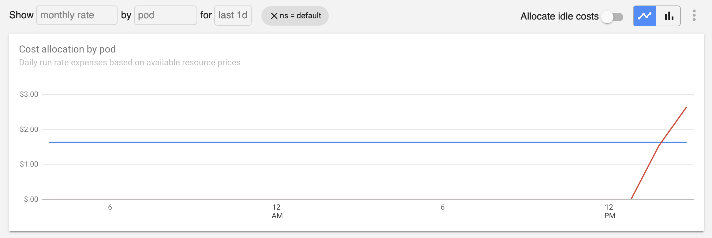

Auditing the cost of workloads can be complex in dynamic Kubernetes environments. 
We've created this guide to help you spot check costs and ensure they are calculated as expected. 

1. **Identify a pod or namespace to audit.** In this example we will audit the `default` namespace. 
2. **Open Prometheus console.** We recommend going directly to the underlying data in Prometheus for an audit. Complete the following steps to view the console for our bundled Prometheus: 

    * Execute `kubectl port-forward --namespace kubecost service/kubecost-prometheus-server 9003:80`
    * Point your browser to <http://localhost:9003>

3. **Verify raw allocation metrics.** Run the following queries and then visit the Prometheus graph tab. Note that allocations are the max of resource requests and usage. Ensure these values are consistent with Kubernetes API and/or cadvisor metrics.

    * `container_cpu_allocation{namespace="default"}`
    * `container_memory_allocation_bytes{namespace="default"}`

4. **Verify monthly node prices.** Ensure these are consistent with cloud provider prices or custom prices provided:

    * `node_cpu_hourly_cost * 730`
    * `node_ram_hourly_cost * 730`
    * `node_total_hourly_cost * 730`
    * `kube_node_status_capacity_cpu_cores * on(node) group_left() node_cpu_hourly_cost * 730 + kube_node_status_capacity_memory_bytes * on(node) group_left() node_ram_hourly_cost * 730 / 1024 / 1024 / 1024`
    
    **Note:** Prometheus values do not account for sustained use or other discounts applied in Settings.

5. **Calculate total resource costs.** Calculate the previously audited allocation by the previously audited price. 

    * `container_cpu_allocation{namespace="default"} * on(instance) group_left() node_cpu_hourly_cost * 730`
    * `container_memory_allocation_bytes{namespace="default"} / 1024 / 1024 / 1024  * on(instance) group_left() node_ram_hourly_cost * 730`

6. **Confirm consistency with monthly Allocation view.** Visit the Allocation tab in the Kubecost product. Filter by `default ` namespace. Select `monthly run rate` by `pod` view then view the time series chart to confirm the values in the previous step are consistent. 

**Reminder:** Remember to apply any sustained use or other discounts.

## container_cpu_allocation{namespace="default"} missing scrapes
## allocation starts at lower value? 
## node metrics can be cached 
