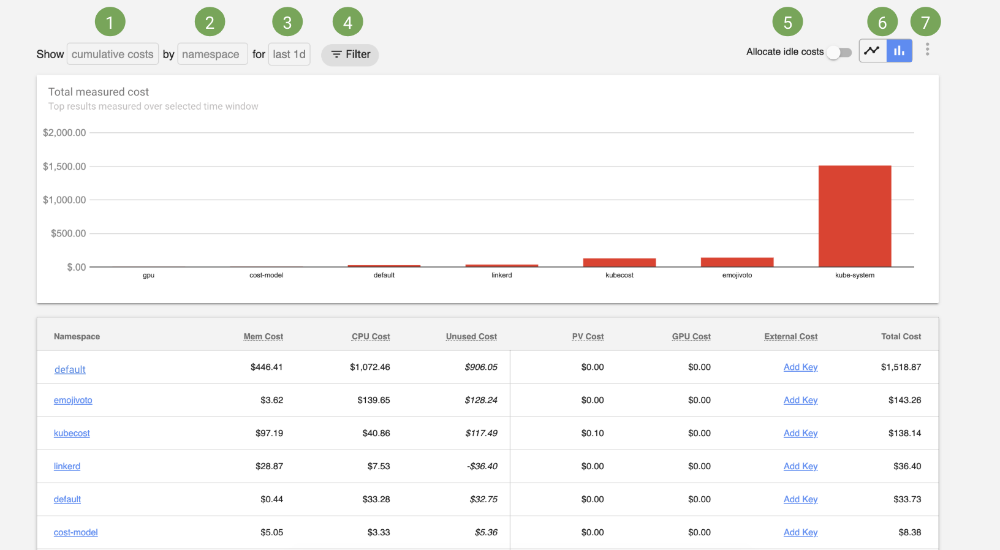

The Cost Allocation page allows you to quickly see spend across all Kubernetes concepts. This article describes how you can control the data displayed in this view. 

### 1. Cost metrics 
View either cumulative costs measured over the selected time window, or run rate (e.g. hourly, daily, monthly) based on the average resources allocated.  

### 2. Aggregation 
Aggregate cost by namespace, deployment, service and other native Kubernetes concepts. You can also view cost by other meaningful aggregations like Team, Department, or Product. These aggregations are based on Kubernetes labels or annotations, which can be configured in Settings. Resources without a label/annotation will be shown as Not Assigned.  

### 3. Time window
The designated time window for measuring costs. 

### 4. Filter
Filter resouces by namespace to more closely investigate a rise in spend or key cost drivers at different aggregations, e.g. Deployments or Pods. 

### 5. Allocate Idle Cost
Allocating idle costs proportionately assigns total cluster costs to indvidial resources. For example, if your cluster is only 50% utilized, applying idle costs will increase the cost of each pod/namespace by 2x.

### 6. Chart selection
Toggle to the bar chart view to see aggregated costs over the selected window, or the time series view to see cost changes over time.

### 7. Additional options
View other options to export cost data to CSV or view help documentation.
  
  
### Cost metrics

Cost allocation metrics are available for both in-cluster and out-of-cluster resources. Here are short descriptions of each metric:

| Metric 	| Description         	| 
|--------------------	|---------------------	|
| Memory cost        	| The total cost of memory allocated to this object, e.g. namespace or deployment. The amount of memory allocated is the greater of memory usage and memory requested over the measured time window. The price of allocated memory is based on cloud billing APIs or custom pricing sheets. [Learn more](https://github.com/kubecost/cost-model#questions)| 
| CPU Cost        	| The total cost of CPU allocated to this object, e.g. namespace or deployment. The amount of CPU allocated is the greater of CPU usage and CPU requested over the measured time window. The price of allocated CPU is based on cloud billing APIs or custom pricing sheets. [Learn more](https://github.com/kubecost/cost-model#questions) | 
| Unused Cost        	| The cost of requested but not used CPU and memory allocated to this object. This is used to measure the potential savings from efficiency improvements. | 
| PV Cost        	| The cost of persistent storage volumes claimed by this object. Prices are based on cloud billing prices or custom pricing sheets for on-prem deployments. |
| GPU Cost        	| The cost of GPUs requested by this object, as measured by [resource limits](https://kubernetes.io/docs/concepts/configuration/manage-compute-resources-container/). Prices are based on cloud billing prices or custom pricing sheets for on-prem deployments. |
| External Cost        	| The cost of out-of-cluster resources allocated to this object. For example, S3 buckets allocated to a particular Kubernetes deployment. Prices are based on cloud billing data and require a key. This feature is currently available for AWS ([learn more](http://docs.kubecost.com/aws-out-of-cluster.html)) and GCP ([learn more](http://docs.kubecost.com/gcp-out-of-cluster.html)). |
